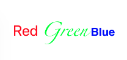

# iOS 一行代码实现富文本显示不同颜色

平时开发项目中，遇到同一行文字显示不同颜色或者文字字体不同时需要用到富文本处理，但每次使用系统自带富文本处理时，都会写出繁琐臃肿的代码，导致代码在视觉效果上不尽人意，于是就简单的对原生富文本实现进行包装，能够实现快速实现上述富文本。

话不多说，先上代码：

```
NSString *content = @"Red Green Blue";
NSMutableAttributedString *attribute = NSMutableAttributedString.attributedString(content)
                                         .phc_font([UIFont systemFontOfSize:40]).phc_textColor(UIColor.redColor)
                                         .phc_text(@"Green").phc_textColor(UIColor.greenColor)
                                         .phc_text(@"Blue").phc_textColor(UIColor.blueColor);

// 将该富文本显示到label上
self.label.attributedText = attribute;
```

显示效果如下图所示：


结果正是预期的那样，一行文字显示不同的颜色，而且也只用了一行代码就实现了，不过上述代码虽然说只有一行，但在视觉效果上并不尽意，可稍作修改，将一行代码拆分为多行：

```    
NSString *content = @"Red Green Blue";
NSMutableAttributedString *attribute = NSMutableAttributedString.attributedString(content);
attribute.phc_font([UIFont systemFontOfSize:40]).phc_textColor(UIColor.redColor);
attribute.phc_text(@"Green").phc_textColor(UIColor.greenColor).phc_font([UIFont fontWithName:@"zapfino" size:35]);
attribute.phc_text(@"Blue").phc_textColor(UIColor.blueColor).phc_font([UIFont fontWithName:@"Helvetica-Bold" size:30]);

self.label.attributedText = attribute;

```

结果如下：




上述代码不仅仅设置了不同的颜色，还设置了不同的字体，并且将代码拆分为多行，但总体上代码量还是要比使用原生实现少很多。

除了上述显示不同的颜色和字体，也可以实现其他的，例如：下划线、斜体、阴影、中空等等，具体使用方法与上述类似。

**使用方法：**
1. 将 `NSAttributedString+PHC.h` 和 `NSAttributedString+PHC.m` 放入项目文件中；
2. 在使用富文本的文件中导入 `#import "NSAttributedString+PHC.h"` 头文件即可。


**使用注意：**

1.  当文本中出现重复字符串时，使用 `.phc_text` 只会对第一次出现的字符串有效，之后的无影响，如若出现重复字符串，可单独新建一个 `NSMutableAttributedString ` 变量，最后追加或插入到原有的富文本中。
2. 对与富文本中显示图片和链接还未做好简单处理，需自定义 `NSTextAttachment` 或 `NSURL` 变量。


如果在使用过程中，遇到问题，欢迎指正。